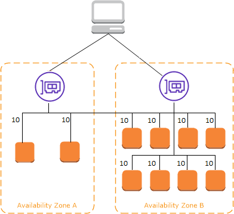
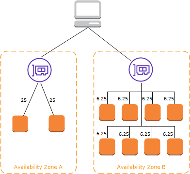

# ELB: Elastic Load Balancers

Load balancers are servers that forward internet traffic to multiple servers (EC2 Instances) downstream

## Why use a load balancer?
* Spread load across multiple downstream instances
* Expose a single point of access (DNS) to your application
* Seamlessly handle failures of downstream instances
* Do regular health checks to your instances
* Provide SSL termination (HTTPS) for your websites
* Enforce stickiness with cookies
* High availability across zones
* Separate public traffic from private traffic

## AN ELB (EC2 Load Balancer) is a managed load balancer
* AWS guarantees that it will be working
* AWS takes care of upgrades, maintenance, high availability
* AWS provides only a few configuration knobs

It costs less to setup your own load balancer, but it will be a lot more effort on your end. It is integrated with many AWS offerings / services

## Types of load balancers on AWS
* Classic Load Balancer (v1 - older generation - 2009)
* Application Load Balancer (v2 - new generation - 2016)
* Network Load Balancer (v2 - new generation - 2017)
* You can setup internal or external ELBs

## Health Checks
* Health checks are crucial for load balancers
* They enable the load balancer to know if instances it forwards traffic to are available to reply to requests
* The health check is done on a port and a route (/health is common)
* If the response is not 200 (OK), then the instance is unhealthy

## Application Load Balancer (v2)
* Application load balancers (Layer 7) allow to do:
  * Load balancing to multiple HTTP applications across machines (target groups)
  * Load balancing to multiple applications on the same machine (ex: containers)
  * Load balancing based on route in URL
  * Load balancing based on hostname in URL 
* Basically, they’re awesome for micro services & container-based application (example: Docker & Amazon ECS) 
* Has a port mapping feature to redirect to a dynamic port 
* In comparison, we would need to create one Classic Load Balancer per application before.That was very expensive and inefficient!
* Good to Know
    * Stickiness can be enabled at the target group level
        * Same request goes to the same instance
        * Stickiness is directly generated by the ALB (NOT the application)
    * ALB supports HTTP/HTTPS & Web sockets protocols
    * The application servers don’t see the IP of the client directly
        * The true IP of the client is inserted in the header X-Forwarded-For
        * We can also get Port (X-Forwarded-Port) and protocol (X-Forwarded-Proto)

## Network Load Balancer (v2)
* Layer 4 allow you to do:
    * Forward TCP traffic to your instances
    * Handle millions of requests per second
    * Support for static IP or elastic IP
    * Less latency ~100ms (vs 400 ms for ALB)
* Network Load Balancers are mostly used for extreme performance and should not be the default load balancer you choose
* Overall, the creation process is the same as the Application Load Balancer

## Security Groups
* The security group for your Application Load Balancer controls the traffic that is allowed to reach and leave the load balancer.
* You must ensure that your load balancer can communicate with registered targets on both the listener port and the health check port.
* Whenever you add a listener to your load balancer or update the health check port for a target group used by the load balancer to route requests, you must verify that the security groups associated with the load balancer allow traffic on the new port in both directions.
* If they don't, you can edit the rules for the currently associated security groups or associate different security groups with the load balancer. You can choose the ports and protocols to allow.

## Load balancer nodes
Elastic Load Balancing creates a load balancer node in the Availability Zone

* **Cross-zone is enable**

* **Cross-zone is disable**

## Load Balancers Good to Know
* Any Load Balancer (CLB, ALB, NLB) has a static host name. They do not resolve and use underlying IP
* LBs can scale but not instantaneously - contact AWS for a “warm up”
* NLB directly see the client IP
* 4xx errors are client induced errors
* 5xx errors are application induced errors
    * Load balancer Errors 503 means at capacity or no registered target
* If the LB can’t connect to your application, check your security
