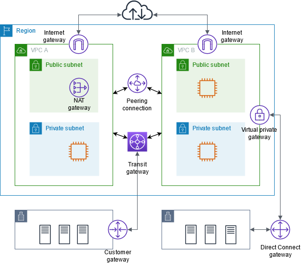

# VPC: Virtual Private Cloud

Within a region, you’re able to create VPCs. Each VPC contain subnets (networks). Each subnet must be mapped to an AZ. It’s common to have a public ip and private ip subnet. It’s common to have many subnets per AZ.

## Subnet
- A subnet is a range of IP addresses in your VPC. You can create AWS resources, such as EC2 instances, in specific subnets.

- Each subnet must reside entirely within one Availability Zone and cannot span zones

- Subnet types
The subnet type is determined by how you configure routing for your subnets. For example:

  - **Public subnet** – The subnet has a direct route to an internet gateway. Resources in a public subnet can access the public internet.

  - **Private subnet** – The subnet does not have a direct route to an internet gateway. Resources in a private subnet require a NAT device to access the public internet.

  - **VPN-only subnet** – The subnet has a route to a Site-to-Site VPN connection through a virtual private gateway. The subnet does not have a route to an internet gateway.

  - **Isolated subnet** – The subnet has no routes to destinations outside its VPC. Resources in an isolated subnet can only access or be accessed by other resources in the same VPC.

## Public Subnets usually contain:
* Load Balancers
* Static Websites
* Files
* Public Authentication Layers

Private Subnets usually contain:
* Web application servers
* Databases

## VPC connecting

- VPC A and VPC B are connected to the internet through an internet gateway
- The EC2 instance in the private subnet of VPC A can connect to the internet using the NAT gateway in the public subnet of VPC A
- The EC2 instance in the public subnet of VPC B can connect to the internet using the internet gateway
- VPC A and VPC B are connected to each other through a VPC peering connection and a transit gateway
- The transit gateway has a VPN attachment to a data center
- VPC B has a AWS Direct Connect connection to a data center.

## Elastic IP
An Elastic IP address is a static, public IPv4 address designed for dynamic cloud computing. You can associate an Elastic IP address with any instance or network interface in any VPC in your account. With an Elastic IP address, you can mask the failure of an instance by rapidly remapping the address to another instance in your VPC.

## Monitoring
- **VPC Flow Logs** is a feature that enables you to capture information about the IP traffic going to and from network interfaces in your VPC. Flow log data can be published to the following locations: Amazon CloudWatch Logs, Amazon S3, or Amazon Data Firehose. After you create a flow log, you can retrieve and view the flow log records in the log group, bucket, or delivery stream that you configured.
- Amazon VPC publishes data about your VPCs to Amazon CloudWatch. You can retrieve statistics about your VPCs as an ordered set of time-series data, known as metrics. Think of a metric as a variable to monitor and the data as the value of that variable over time.

## Security
### Security group
- A security group controls the traffic that is allowed to reach and leave the resources that it is associated with.
- Security groups are stateful, so allowing inbound traffic to the necessary ports enables the connection

### Network access control list (ACL)
- A network access control list (ACL) allows or denies specific inbound or outbound traffic at the subnet level. 
- You can use the default network ACL for your VPC, or you can create a custom network ACL for your VPC with rules that are similar to the rules for your security groups in order to add an additional layer of security to your VPC.

## PrivateLink
- AWS PrivateLink establishes private connectivity between virtual private clouds (VPC) and supported AWS services, services hosted by other AWS accounts, and supported AWS Marketplace services.
- You do not need to use an internet gateway, NAT device, AWS Direct Connect connection, or AWS Site-to-Site VPN connection to communicate with the service.

## Endpoints
- **VPC endpoint = Interface Endpoint**: Provide reliable connectivity to Amazon Services. An interface endpoint is an elastic network interface (ENI) similar to a virtual network card but with a private IP address
- **Gateway Endpoint**: Gateway VPC endpoints provide reliable connectivity to Amazon S3 and DynamoDB without requiring an internet gateway or a NAT device for your VPC.

## AWS VPC Summary
* VPC & Regions aren’t much asked at the developer associate exam
* All new accounts come with a default VPC
* It’s possible to use a VPN to connect to a VPC
* VPC flow logs allow you to monitor the traffic within, in and out of your VPC (useful for security, performance, audit)
* VPC are per Account per Region
* Subnets are per VPC per AZ
* Some AWS resources can be deployed in VPC while others can’t
* You can peer VPC (within or across accounts) to make it look like they’re part of the same network