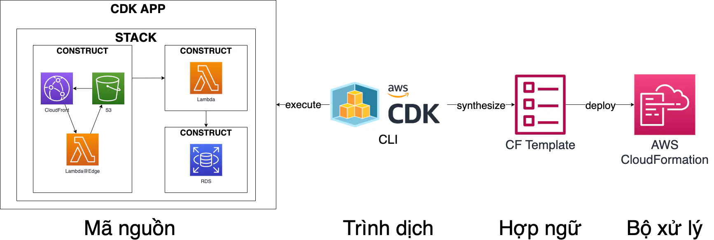
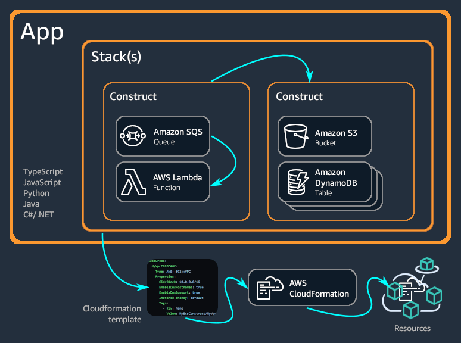

# AWS Cloud Development Kit - CDK

The AWS Cloud Development Kit (AWS CDK) is an open-source software development framework to define your cloud application resources using familiar programming languages.

## CDK Workflow
The standard AWS CDK development workflow is similar to the workflow you're already familiar as a developer. There are a few extra steps:

1. Create the app from a template provided by AWS CDK - Each AWS CDK app should be in its own directory, with its own local module dependencies. Create a new directory for your app. Now initialize the app using the cdk init command, specifying the desired template ("app") and programming language. The cdk init command creates a number of files and folders inside the created home directory to help you organize the source code for your AWS CDK app.

2. Add code to the app to create resources within stacks - Add custom code as is needed for your application.

3. Build the app (optional) - In most programming environments, after making changes to your code, you'd build (compile) it. This isn't strictly necessary with the AWS CDK—the Toolkit does it for you so you can't forget. But you can still build manually whenever you want to catch syntax and type errors.

4. Synthesize one or more stacks in the app to create an AWS CloudFormation template - Synthesize one or more stacks in the app to create an AWS CloudFormation template. The synthesis step catches logical errors in defining your AWS resources. If your app contains more than one stack, you'd need to specify which stack(s) to synthesize.

5. Deploy one or more stacks to your AWS account - It is optional (though good practice) to synthesize before deploying. The AWS CDK synthesizes your stack before each deployment. If your code has security implications, you'll see a summary of these and need to confirm them before deployment proceeds. cdk deploy is used to deploy the stack using CloudFormation templates. This command displays progress information as your stack is deployed. When it's done, the command prompt reappears

## Components
The AWS CDK consists of two primary parts:
* **AWS CDK Construct Library** – A collection of pre-written modular and reusable pieces of code, called constructs, that you can use, modify, and integrate to develop your infrastructure quickly. The goal of the AWS CDK Construct Library is to reduce the complexity required to define and integrate AWS services together when building applications on AWS.

* **AWS CDK Toolkit** – A command line tool for interacting with CDK apps. Use the AWS CDK Toolkit to create, manage, and deploy your AWS CDK projects.

## Concepts

### Supported Language
 - TypeScript (the first version supports TypeScript only)
 - JavaScript
 - Python
 - Java
 - C#/.Net
 - and Go

### Projects
Project represents the files and folders that contain your CDK code. Contents will vary based on your programming language.

### Apps
Application or app is a collection of one or more CDK stacks. Stacks are a collection of one or more constructs, which define AWS resources and properties. Therefore, the overall grouping of your stacks and constructs are known as your CDK app.

### Stacks
- Stack is a collection of one or more constructs, which define AWS resources.
- Each CDK stack represents an AWS CloudFormation stack in your CDK app.
- At deployment, constructs within a stack are provisioned as a single unit, called an AWS CloudFormation stack.

### Constructs
- Constructs are the basic building blocks of CDK applications.
- A construct is a component within your application that represents one or more AWS CloudFormation resources and their configuration.
- You build your application, piece by piece, by importing and configuring constructs.

- Constructs are classes that you import into your CDK apps. Constructs are available from the AWS Construct Library. You can also create and distribute your own constructs, or use constructs created by third-party developers
##### Levels
* **L1** - L1 constructs, also known as CFN resources, are the lowest-level construct and offer no abstraction. Each L1 construct maps directly to a single AWS CloudFormation resource. With L1 constructs, you import a construct that represents a specific AWS CloudFormation resource. You then define the resource’s properties within your construct instance.

* **L2** - L2 constructs, also known as curated constructs, are thoughtfully developed by the CDK team and are usually the most widely used construct type. L2 constructs map directly to single AWS CloudFormation resources, similar to L1 constructs. Compared to L1 constructs, L2 constructs provide a higher-level abstraction through an intuitive intent-based API. L2 constructs include sensible default property configurations, best practice security policies, and generate a lot of the boilerplate code and glue logic for you.
* **L3** - L3 constructs, also known as patterns, are the highest-level of abstraction. Each L3 construct can contain a collection of resources that are configured to work together to accomplish a specific task or service within your application. L3 constructs are used to create entire AWS architectures for particular use cases in your application.

### Environments
An environment is the target AWS account and AWS Region that stacks are deployed to. All stacks in your CDK app are explicitly or implicitly associated with an environment (env).

### Bootstrapping
Bootstrapping is the process of preparing an environment for deployment. Bootstrapping is a one-time action that you must perform for every environment that you deploy resources into.

### Resources
Resources are what you configure to use AWS services in your applications. Resources are a feature of AWS CloudFormation. By configuring resources and their properties in a AWS CloudFormation template, you can deploy to AWS CloudFormation to provision your resources. With the AWS Cloud Development Kit (AWS CDK), you can configure resources through constructs. You then deploy your CDK app, which involves synthesizing a AWS CloudFormation template and deploying to AWS CloudFormation to provision your resources.

### Identifiers
When building AWS Cloud Development Kit (AWS CDK) apps, you will use many types of identifiers and names. To use the AWS CDK effectively and avoid errors, it is important to understand the types of identifiers.

Identifiers must be unique within the scope in which they are created; they do not need to be globally unique in your AWS CDK application.

If you attempt to create an identifier with the same value within the same scope, the AWS CDK throws an exception.

### Tokens
Tokens represent values that can only be resolved at a later time in the app lifecycle. For example, the name of an Amazon Simple Storage Service (Amazon S3) bucket that you define in your CDK app is only allocated when the AWS CloudFormation template is synthesized. If you print the bucket.bucketName attribute, which is a string, you will see that it contains something like the following:

### Parameters
Parameters are custom values that are supplied at deployment time. Parameters are a feature of AWS CloudFormation. Since the AWS Cloud Development Kit (AWS CDK) synthesizes AWS CloudFormation templates, it also offers support for deployment-time parameters.

